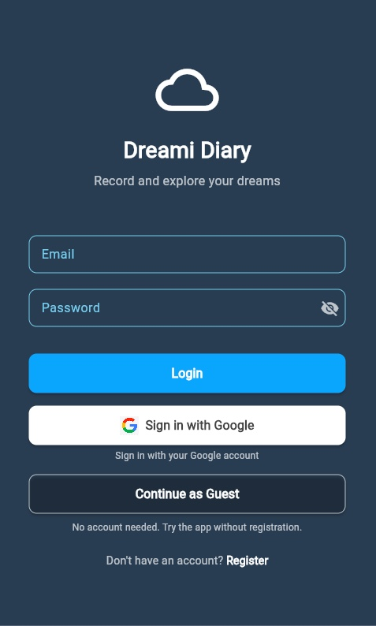

# Dreami Diary - Dream Journal App

A modern Flutter application that allows users to record, track, and analyze their dreams. Built with a focus on user experience and privacy.

## Features

- 📝 Record and manage your dreams
- 🔐 Secure authentication with Google Sign-in
- 🌙 Dark theme for comfortable night-time use
- 📱 Cross-platform support (iOS, Android, Web, Desktop)
- 🔒 Secure storage for sensitive data
- 🎨 Modern Material Design UI
- 🌐 Environment-based configuration

## Download & Links

### App Stores

- [Google Play Store](https://play.google.com/store/apps/details?id=com.tinystars.dreamidiary)

### Web Version

- [Web App](https://dreamidiary.com) (Coming Soon)

- 💻 [Backend Repository](https://github.com/Syamgith/ai-dream-journal)

### Screenshots

#### Mobile App

<p align="center">
  
  
  
</p>

## Tech Stack

- **Framework**: Flutter/Dart
- **State Management**: Riverpod
- **Authentication**: Google Sign-in
- **Storage**: Flutter Secure Storage
- **Network**: HTTP package
- **Environment**: Flutter Dotenv
- **Internationalization**: Intl package

## Project Structure

```
lib/
├── core/           # Core functionality and utilities
├── features/       # Feature-based modules
│   ├── auth/      # Authentication
│   ├── dreams/    # Dream recording and management
│   ├── profile/   # User profile
│   ├── settings/  # App settings
│   ├── feedback/  # User feedback
│   ├── about/     # About section
│   └── shared/    # Shared components
├── main.dart      # Application entry point
└── routes.dart    # Route definitions
```

## Getting Started

### Prerequisites

- Flutter SDK (>=2.17.0)
- Dart SDK
- Android Studio / Xcode (for mobile development)
- Git

### Installation

1. Clone the repository:

   ```bash
   git clone [repository-url]
   ```

2. Navigate to the project directory:

   ```bash
   cd dream_journal_app
   ```

3. Install dependencies:

   ```bash
   flutter pub get
   ```

4. Create a `.env` file in the root directory with your configuration:

   ```
   API_URL=your_api_url
   GOOGLE_CLIENT_ID=your_google_client_id
   ```

5. Run the app:
   ```bash
   flutter run
   ```

### Docker Setup

The project includes Docker support for containerized development:

```bash
# Build the Docker image
docker build -t dreami-diary .

# Run the container
docker-compose up
```

## Google Sign-in Setup

For Google Sign-in functionality, follow the setup instructions in:

- `GOOGLE_SIGNIN_SETUP.md`
- `BACKEND_GOOGLE_SIGNIN_UPDATE.md`
- `FIX_ANDROID_GOOGLE_SIGNIN.md`

## Development

### Code Style

The project follows Flutter's recommended code style. Linting rules are configured in `analysis_options.yaml`.

### Building for Production

```bash
# For Android
flutter build apk

# For iOS
flutter build ios

# For Web
flutter build web
```

## Architecture

The application follows a feature-first architecture with the following key components:

- **State Management**: Uses Riverpod for predictable state management
- **Routing**: Centralized routing system in `routes.dart`
- **Theme**: Custom dark theme implementation
- **Security**: Secure storage for sensitive data
- **Environment**: Environment variable management for configuration

## Contributing

1. Fork the repository
2. Create your feature branch (`git checkout -b feature/AmazingFeature`)
3. Commit your changes (`git commit -m 'Add some AmazingFeature'`)
4. Push to the branch (`git push origin feature/AmazingFeature`)
5. Open a Pull Request

## License

This project is licensed under the MIT License - see the LICENSE file for details.

## Acknowledgments

- Flutter team for the amazing framework
- All contributors who have helped shape this project
- The open-source community for their invaluable tools and packages
